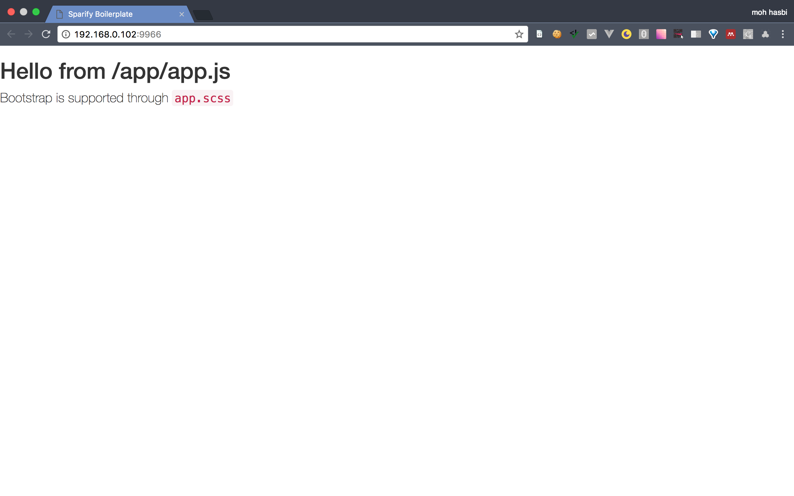
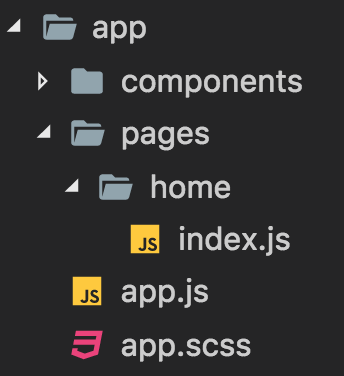

This is an example of creating bootstrap carousel.

# Tutorial
## Pre-requisites
to follow this tutorial, [node](https://nodejs.org/en/) and [git](https://git-scm.com/) need to be installed.

## Steps
1. Download [sparify](https://github.com/mohhasbias/sparify) to target directory
```bash
git clone https://github.com/mohhasbias/sparify my-app
```
2. Make sure the boilerplate is working. First, get into the directory
```bash
cd my-app
```
3. Install dependencies
```bash
npm install
```
4. Run dev script. When everything is OK, it will open up a browser.
```bash
npm run dev
```

5. Create new folder in ```app/pages```. name it ```home```. create file ```index.js```.

6. Add code to display html content using ```yo``` and ```diffhtml```.
```javascript
var yo = require('yo-yo');
var diffhtml = require('diffhtml');

module.exports = function() {
  // render template
  var html = yo`
    <h1>Hello from ${__filename}</h1>
  `;

  // render to DOM
  diffhtml.innerHTML(
    document.getElementById('app'),
    html
  );
}
```
this file contains function that could be called to render home page.

7. Modify ```app.js``` to call function to render ```home```. clear the content of ```app.js```, replace it with this code
```javascript
var homePage = require('./pages/home');

require('./app.scss');

homePage();
```
8. Update home page to display bootstrap carousel markup. Replace current html template from this
```javascript
var html = yo`
  <h1>Hello from ${__filename}</h1>
`;
```
to this
```javascript
var html = yo`
  <div id="carousel-example-generic" class="carousel slide" data-ride="carousel">
    <!-- Indicators -->
    <ol class="carousel-indicators">
      <li data-target="#carousel-example-generic" data-slide-to="0" class="active"></li>
      <li data-target="#carousel-example-generic" data-slide-to="1"></li>
      <li data-target="#carousel-example-generic" data-slide-to="2"></li>
    </ol>

    <!-- Wrapper for slides -->
    <div class="carousel-inner" role="listbox">
      <div class="item active">
        
        <div class="carousel-caption">
          This is a walrus
        </div>
      </div>
      <div class="item">
        
        <div class="carousel-caption">
          These are strawberries
        </div>
      </div>
      <div class="item">
        
        <div class="carousel-caption">
          This is a lion
        </div>
      </div>
    </div>

    <!-- Controls -->
    <a class="left carousel-control" href="#carousel-example-generic" role="button" data-slide="prev">
      <span class="glyphicon glyphicon-chevron-left" aria-hidden="true"></span>
      <span class="sr-only">Previous</span>
    </a>
    <a class="right carousel-control" href="#carousel-example-generic" role="button" data-slide="next">
      <span class="glyphicon glyphicon-chevron-right" aria-hidden="true"></span>
      <span class="sr-only">Next</span>
    </a>
  </div>
`;
```