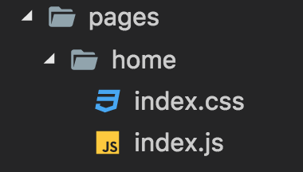

This is an example of creating line drawing using mouse in D3.js.

# Tutorial
## Pre-requisites
To follow this tutorial, [node](https://nodejs.org/en/) and [git](https://git-scm.com/) need to be installed.

## Steps
1. Download [sparify](https://github.com/mohhasbias/sparify) to target directory
    ```bash
    git clone https://github.com/mohhasbias/sparify my-app
    ```

2. Make sure the boilerplate is working. First, get into the directory
    ```bash
    cd my-app
    ```

3. Install dependencies
    ```bash
    npm install
    ```

4. Run dev script. When everything is OK, it will open up a browser.
    ```bash
    npm run dev
    ```
    

5. Create new folder in ```app/pages```. name it ```home```. create file ```index.js```.
    

6. Add code to display html content using ```yo``` and ```diffhtml```.
    ```javascript
    var yo = require('yo-yo');
    var diffhtml = require('diffhtml');

    module.exports = function() {
      // render template
      var html = yo`
        <h1>Hello from ${__filename}</h1>
      `;

      // render to DOM
      diffhtml.innerHTML(
        document.getElementById('app'),
        html
      );
    }
    ```
    this file contains function that could be called to render home page.

7. Modify ```app.js``` to call function to render ```home```. clear the content of ```app.js```, replace it with this code
    ```javascript
    var homePage = require('./pages/home');

    require('./app.css');

    homePage();
    ```
8. Update home page to display svg using d3. Replace current html template from this
    ```javascript
    var yo = require('yo-yo');
    var diffhtml = require('diffhtml');

    module.exports = function() {
      // render template
      var html = yo`
        <h1>Hello from ${__filename}</h1>
      `;

      // render to DOM
      diffhtml.innerHTML(
        document.getElementById('app'),
        html
      );
    }
    ```
    to this
    ```javascript
    var yo = require('yo-yo');
    var diffhtml = require('diffhtml');
    var d3 = require('d3');

    module.exports = function() {
      require('./index.css');

      // render template
      var html = yo`
        <div id="d3-draw-area"></div>
      `;

      // render to DOM
      diffhtml.innerHTML(
        document.getElementById('app'),
        html
      );

      // d3 app
      var d3DrawArea = d3.select('#d3-draw-area')
        .append('svg')
        .attr('width', window.innerWidth)
        .attr('height', window.innerHeight);
    }
    ```
9. Add some styling by adding new file ```index.css``` inside ```home``` directory alongside with ```index.js```
    
10. Add background color for d3-draw-area
    ```css
    #d3-draw-area {
      background-color: #e3e3e3;
    }
    ```
11. 